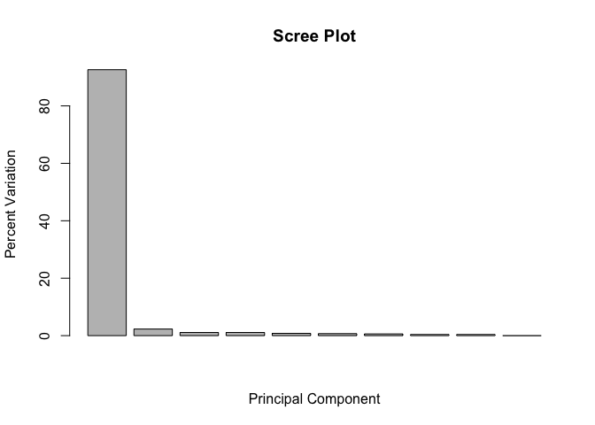
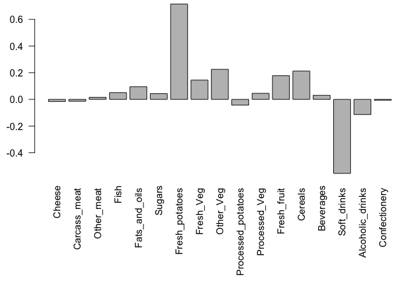

Class8: Machine learning
================
Victoria Shi
4/25/2019

## K-means clustering

Let’s start with an example of running the **kmeans()** function

``` r
 # Generate some example data for clustering
tmp <- c(rnorm(30,-3), rnorm(30,3))
x <- cbind(x=tmp, y=rev(tmp))
plot(x)
```

<!-- -->

Use the kmeans() function setting k to 2 and nstart=20 Inspect/print the
results \>Q. How many points are in each cluster? 30 \>Q. What
‘component’ of your result object details - cluster size? - cluster
assignment/membership? - cluster center? \>Plot x colored by the kmeans
cluster assignment and add cluster centers as blue points

``` r
cluster<-kmeans(x, centers = 2, nstart = 20)
cluster
```

    ## K-means clustering with 2 clusters of sizes 30, 30
    ## 
    ## Cluster means:
    ##           x         y
    ## 1 -2.936324  3.083860
    ## 2  3.083860 -2.936324
    ## 
    ## Clustering vector:
    ##  [1] 1 1 1 1 1 1 1 1 1 1 1 1 1 1 1 1 1 1 1 1 1 1 1 1 1 1 1 1 1 1 2 2 2 2 2
    ## [36] 2 2 2 2 2 2 2 2 2 2 2 2 2 2 2 2 2 2 2 2 2 2 2 2 2
    ## 
    ## Within cluster sum of squares by cluster:
    ## [1] 58.34191 58.34191
    ##  (between_SS / total_SS =  90.3 %)
    ## 
    ## Available components:
    ## 
    ## [1] "cluster"      "centers"      "totss"        "withinss"    
    ## [5] "tot.withinss" "betweenss"    "size"         "iter"        
    ## [9] "ifault"

``` r
cluster$size
```

    ## [1] 30 30

``` r
cluster$centers
```

    ##           x         y
    ## 1 -2.936324  3.083860
    ## 2  3.083860 -2.936324

``` r
cluster$cluster
```

    ##  [1] 1 1 1 1 1 1 1 1 1 1 1 1 1 1 1 1 1 1 1 1 1 1 1 1 1 1 1 1 1 1 2 2 2 2 2
    ## [36] 2 2 2 2 2 2 2 2 2 2 2 2 2 2 2 2 2 2 2 2 2 2 2 2 2

``` r
plot(x,col=cluster$cluster)
points(cluster$centers, pch=20, col="blue", cex=3)
```

<!-- -->

## Hierarchical Clustering example

We must give the **hclust()** function a distance matrix not the raw
data as input

``` r
# Distance matrix calculation
d<-dist(x)

# Clustering
hc<-hclust(d)
plot(hc)
```

<!-- -->

``` r
plot(hc)
abline(h=6,col="red")
```

<!-- -->

``` r
cutree(hc,h=6)
```

    ##  [1] 1 1 1 1 1 1 1 1 1 1 1 1 1 1 1 1 1 1 1 1 1 1 1 1 1 1 1 1 1 1 2 2 2 2 2
    ## [36] 2 2 2 2 2 2 2 2 2 2 2 2 2 2 2 2 2 2 2 2 2 2 2 2 2

``` r
cutree(hc, k=2)
```

    ##  [1] 1 1 1 1 1 1 1 1 1 1 1 1 1 1 1 1 1 1 1 1 1 1 1 1 1 1 1 1 1 1 2 2 2 2 2
    ## [36] 2 2 2 2 2 2 2 2 2 2 2 2 2 2 2 2 2 2 2 2 2 2 2 2 2

``` r
cutree(hc, k=3)
```

    ##  [1] 1 1 1 1 1 1 1 1 1 1 1 1 1 1 1 1 1 1 1 1 1 1 1 1 1 1 1 1 1 1 2 3 2 3 3
    ## [36] 3 2 3 2 3 2 3 2 3 3 3 2 2 2 2 3 3 3 3 2 3 2 3 3 3

``` r
 # Step 1. Generate some example data for clustering
x <- rbind(
  matrix(rnorm(100, mean=0, sd = 0.3), ncol = 2),   # c1
  matrix(rnorm(100, mean = 1, sd = 0.3), ncol = 2), # c2
  matrix(c(rnorm(50, mean = 1, sd = 0.3),           # c3
           rnorm(50, mean = 0, sd = 0.3)), ncol = 2))
colnames(x) <- c("x", "y")
# Step 2. Plot the data without clustering
plot(x)
```

<!-- -->

``` r
# Step 3. Generate colors for known clusters
#         (just so we can compare to hclust results)
col <- as.factor( rep(c("c1","c2","c3"), each=50) )
plot(x, col=col)
```

<!-- -->

> Q. Use the dist(), hclust(), plot() and cutree() functions to return 2
> and 3 clusters Q. How does this compare to your known ‘col’ groups?

``` r
hc<-hclust(dist(x))
plot(hc)
abline(h=2,col="red")
abline(h=2.8, col="blue")
```

<!-- -->

``` r
gp2<-cutree(hc,k=2)
gp3<-cutree(hc,k=3)
```

``` r
gp2
```

    ##   [1] 1 1 1 1 1 1 1 1 1 1 2 1 2 2 1 1 1 1 1 1 1 1 1 1 1 1 1 1 1 2 1 1 1 1 1
    ##  [36] 1 1 1 1 1 1 1 1 1 2 1 1 1 1 1 2 2 2 2 2 2 2 2 2 2 2 2 2 2 2 2 2 2 2 2
    ##  [71] 2 2 2 2 2 2 2 2 2 2 2 2 2 2 2 2 2 2 2 2 2 2 2 2 2 2 2 2 2 2 2 2 2 2 2
    ## [106] 2 2 2 2 2 2 2 1 2 2 2 2 2 2 2 2 2 1 2 2 2 2 2 2 2 2 2 2 2 2 2 2 2 2 2
    ## [141] 2 2 2 2 2 2 2 2 2 2

``` r
plot(x,col=gp2)
```

<!-- -->

``` r
gp2
```

    ##   [1] 1 1 1 1 1 1 1 1 1 1 2 1 2 2 1 1 1 1 1 1 1 1 1 1 1 1 1 1 1 2 1 1 1 1 1
    ##  [36] 1 1 1 1 1 1 1 1 1 2 1 1 1 1 1 2 2 2 2 2 2 2 2 2 2 2 2 2 2 2 2 2 2 2 2
    ##  [71] 2 2 2 2 2 2 2 2 2 2 2 2 2 2 2 2 2 2 2 2 2 2 2 2 2 2 2 2 2 2 2 2 2 2 2
    ## [106] 2 2 2 2 2 2 2 1 2 2 2 2 2 2 2 2 2 1 2 2 2 2 2 2 2 2 2 2 2 2 2 2 2 2 2
    ## [141] 2 2 2 2 2 2 2 2 2 2

``` r
gp3
```

    ##   [1] 1 1 1 1 1 1 1 1 1 1 2 1 2 2 1 1 1 1 1 1 1 1 1 1 1 1 1 1 1 3 1 1 1 1 1
    ##  [36] 1 1 1 1 1 1 1 1 1 3 1 1 1 1 1 3 3 3 3 3 3 3 3 3 3 3 3 3 3 3 3 3 3 3 3
    ##  [71] 3 3 3 3 2 3 3 3 3 3 3 3 3 3 3 3 3 3 3 3 3 3 3 3 3 3 3 3 3 3 2 2 2 2 2
    ## [106] 2 2 2 2 2 2 2 1 2 2 2 2 2 2 2 2 2 1 2 2 2 2 2 2 2 2 2 2 2 2 2 2 2 2 3
    ## [141] 2 2 2 2 3 2 2 2 2 2

``` r
table(gp2)
```

    ## gp2
    ##   1   2 
    ##  47 103

``` r
table(gp3)
```

    ## gp3
    ##  1  2  3 
    ## 47 50 53

``` r
table(gp2,gp3)
```

    ##    gp3
    ## gp2  1  2  3
    ##   1 47  0  0
    ##   2  0 50 53

# PCA: Principal Component Analysis

We will use the **prcomp()** function for PCR

``` r
## You can also download this file from the class website!
     mydata <- read.csv("https://tinyurl.com/expression-CSV",
                        row.names=1)
```

100 genes in this dataset

``` r
nrow(mydata)
```

    ## [1] 100

``` r
ncol(mydata)
```

    ## [1] 10

``` r
colnames(mydata)
```

    ##  [1] "wt1" "wt2" "wt3" "wt4" "wt5" "ko1" "ko2" "ko3" "ko4" "ko5"

Running out PCA analysis on the transpose of our data.

``` r
pca<-prcomp(t(mydata), scale=TRUE)
```

PCA plot

``` r
## A basic PC1 vs PC2 2-D plot
plot(pca$x[,1], pca$x[,2], xlab="PC1", ylab="PC2")
```

<!-- -->

Variance captured per PC

``` r
pca.var <- pca$sdev^2
```

Calculate the percent variance captures in each PC

``` r
pca.var <- pca$sdev^2
pca.var.per <- round(pca.var/sum(pca.var)*100, 1)
```

``` r
pca.var <- pca$sdev^2
pca.var.per <- round(pca.var/sum(pca.var)*100, 1)
barplot(pca.var.per, main="Scree Plot",
        xlab="Principal Component", ylab="Percent Variation")
```

<!-- -->

``` r
colvec <- colnames(mydata)
colvec[grep("wt", colvec)] <- "red"
colvec[grep("ko", colvec)] <- "blue"
plot(pca$x[,1], pca$x[,2], col=colvec, pch=16,
     xlab=paste0("PC1 (", pca.var.per[1], "%)"),
     ylab=paste0("PC2 (", pca.var.per[2], "%)"))
```

<!-- -->

\#PCA of UK food data

``` r
x <- read.csv("UK_foods.csv",row.names=1)
```

``` r
nrow(x)
```

    ## [1] 17

``` r
ncol(x)
```

    ## [1] 4

``` r
head(x,6)
```

    ##                England Wales Scotland N.Ireland
    ## Cheese             105   103      103        66
    ## Carcass_meat       245   227      242       267
    ## Other_meat         685   803      750       586
    ## Fish               147   160      122        93
    ## Fats_and_oils      193   235      184       209
    ## Sugars             156   175      147       139

``` r
dim(x)
```

    ## [1] 17  4

``` r
barplot(as.matrix(x), beside=TRUE, col=rainbow(nrow(x)))
```

<!-- -->

``` r
barplot(as.matrix(x), beside=FALSE, col=rainbow(nrow(x)))
```

<!-- -->

``` r
pairs(x, col=rainbow(10), pch=16)
```

<!-- -->

``` r
pca<-prcomp(t(x))
summary(pca)
```

    ## Importance of components:
    ##                             PC1      PC2      PC3       PC4
    ## Standard deviation     324.1502 212.7478 73.87622 4.189e-14
    ## Proportion of Variance   0.6744   0.2905  0.03503 0.000e+00
    ## Cumulative Proportion    0.6744   0.9650  1.00000 1.000e+00

``` r
plot(pca$x[,1], pca$x[,2], xlab="PC1", ylab="PC2", xlim=c(-270,500))
text(pca$x[,1], pca$x[,2], colnames(x),col=c("red","yellow","blue","green"))
```

<!-- -->

``` r
v <- round( pca$sdev^2/sum(pca$sdev^2) * 100 )
v
```

    ## [1] 67 29  4  0

``` r
z <- summary(pca)
z$importance
```

    ##                              PC1       PC2      PC3          PC4
    ## Standard deviation     324.15019 212.74780 73.87622 4.188568e-14
    ## Proportion of Variance   0.67444   0.29052  0.03503 0.000000e+00
    ## Cumulative Proportion    0.67444   0.96497  1.00000 1.000000e+00

``` r
barplot(v, xlab="Principal Component", ylab="Percent Variation")
```

<!-- -->

``` r
par(mar=c(10, 3, 0.35, 0))
barplot( pca$rotation[,1], las=2 )
```

<!-- -->

``` r
par(mar=c(10, 3, 0.35, 0))
barplot( pca$rotation[,2], las=2 )
```

<!-- -->

``` r
biplot(pca)
```

<!-- -->
