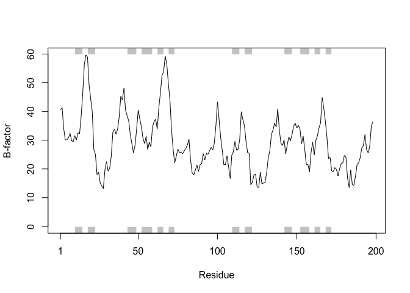

Class11: Structural Bioinformatics
================

## The PDB database

The [PDB](http://www.rcsb.org/) is the main repository for biomolecular
structure data.

Here we examine the contents of the PDB:

``` r
db<-read.csv("Data Export Summary.csv", row.names = 1)
db
```

    ##                     Proteins Nucleic.Acids Protein.NA.Complex Other  Total
    ## X-Ray                 126880          2012               6547     8 135447
    ## NMR                    11062          1279                259     8  12608
    ## Electron Microscopy     2277            31                800     0   3108
    ## Other                    256             4                  6    13    279
    ## Multi Method             129             5                  2     1    137

How many are X-Ray

``` r
(db$Total[1]/sum(db$Total))*100
```

    ## [1] 89.35736

How many are X-Ray, etc…

``` r
(db$Total/sum(db$Total))*100
```

    ## [1] 89.35736481  8.31777489  2.05041595  0.18406244  0.09038191

What proportion of structures are protein?

``` r
(sum(db$Proteins)/sum(db$Total))*100
```

    ## [1] 92.75955

We could also try the datapasta package and copy from website and
“Addins” \> “Paste as data.frame”

``` r
library(datapasta)

temp<- data.frame (stringsAsFactors=FALSE,
   Experimental.Method = c("X-Ray", "NMR", "Electron Microscopy", "Other",
                           "Multi Method", "Total"),
              Proteins = c(126880, 11062, 2277, 256, 129, 140604),
         Nucleic.Acids = c(2012, 1279, 31, 4, 5, 3331),
    ProteinComplex = c(6547, 259, 800, 6, 2, 7614),
                 Other = c(8, 8, 0, 13, 1, 30),
                 Total = c(135447, 12608, 3108, 279, 137, 151579))

temp
```

    ##   Experimental.Method Proteins Nucleic.Acids ProteinComplex Other  Total
    ## 1               X-Ray   126880          2012           6547     8 135447
    ## 2                 NMR    11062          1279            259     8  12608
    ## 3 Electron Microscopy     2277            31            800     0   3108
    ## 4               Other      256             4              6    13    279
    ## 5        Multi Method      129             5              2     1    137
    ## 6               Total   140604          3331           7614    30 151579

> Q2.Type HIV in the PDB website search box on the home page and
> determine how many HIV-1 protease structures are in the current PDB?

There are 1157 as of 2019-05-07 See:
<http://www.rcsb.org/pdb/results/results.do?tabtoshow=Current&qrid=7F9EE90A>

## Introduction to bio3D

``` r
library(bio3d)
```

``` r
pdb<-read.pdb("1hsg")
```

    ##   Note: Accessing on-line PDB file

``` r
pdb
```

    ## 
    ##  Call:  read.pdb(file = "1hsg")
    ## 
    ##    Total Models#: 1
    ##      Total Atoms#: 1686,  XYZs#: 5058  Chains#: 2  (values: A B)
    ## 
    ##      Protein Atoms#: 1514  (residues/Calpha atoms#: 198)
    ##      Nucleic acid Atoms#: 0  (residues/phosphate atoms#: 0)
    ## 
    ##      Non-protein/nucleic Atoms#: 172  (residues: 128)
    ##      Non-protein/nucleic resid values: [ HOH (127), MK1 (1) ]
    ## 
    ##    Protein sequence:
    ##       PQITLWQRPLVTIKIGGQLKEALLDTGADDTVLEEMSLPGRWKPKMIGGIGGFIKVRQYD
    ##       QILIEICGHKAIGTVLVGPTPVNIIGRNLLTQIGCTLNFPQITLWQRPLVTIKIGGQLKE
    ##       ALLDTGADDTVLEEMSLPGRWKPKMIGGIGGFIKVRQYDQILIEICGHKAIGTVLVGPTP
    ##       VNIIGRNLLTQIGCTLNF
    ## 
    ## + attr: atom, xyz, seqres, helix, sheet,
    ##         calpha, remark, call

``` r
attributes(pdb)
```

    ## $names
    ## [1] "atom"   "xyz"    "seqres" "helix"  "sheet"  "calpha" "remark" "call"  
    ## 
    ## $class
    ## [1] "pdb" "sse"

``` r
head(pdb$atom)
```

    ##   type eleno elety  alt resid chain resno insert      x      y     z o
    ## 1 ATOM     1     N <NA>   PRO     A     1   <NA> 29.361 39.686 5.862 1
    ## 2 ATOM     2    CA <NA>   PRO     A     1   <NA> 30.307 38.663 5.319 1
    ## 3 ATOM     3     C <NA>   PRO     A     1   <NA> 29.760 38.071 4.022 1
    ## 4 ATOM     4     O <NA>   PRO     A     1   <NA> 28.600 38.302 3.676 1
    ## 5 ATOM     5    CB <NA>   PRO     A     1   <NA> 30.508 37.541 6.342 1
    ## 6 ATOM     6    CG <NA>   PRO     A     1   <NA> 29.296 37.591 7.162 1
    ##       b segid elesy charge
    ## 1 38.10  <NA>     N   <NA>
    ## 2 40.62  <NA>     C   <NA>
    ## 3 42.64  <NA>     C   <NA>
    ## 4 43.40  <NA>     O   <NA>
    ## 5 37.87  <NA>     C   <NA>
    ## 6 38.40  <NA>     C   <NA>

# Print a subset of $atom data for the first two atoms

``` r
pdb$atom[1:2, c("eleno","elety", "x","y","z")]
```

    ##   eleno elety      x      y     z
    ## 1     1     N 29.361 39.686 5.862
    ## 2     2    CA 30.307 38.663 5.319

# Note that individual $atom records can also be accessed like this

``` r
pdb$atom$elety[1:2]
```

    ## [1] "N"  "CA"

# Which allows us to do the following

``` r
plot.bio3d(pdb$atom$b[pdb$calpha],sse=pdb,typ="l", ylab="B-factor")
```

<!-- -->

# Print a summary of the coordinate data in $xyz

``` r
pdb$xyz
```

    ## 
    ##    Total Frames#: 1
    ##    Total XYZs#:   5058,  (Atoms#:  1686)
    ## 
    ##     [1]  29.361  39.686  5.862  <...>  30.112  17.912  -4.791  [5058] 
    ## 
    ## + attr: Matrix DIM = 1 x 5058

# Examine the row and column dimensions

``` r
dim(pdb$xyz)
```

    ## [1]    1 5058

# Print coordinates for the first two atom

``` r
pdb$xyz[ 1, atom2xyz(1:2) ]
```

    ## [1] 29.361 39.686  5.862 30.307 38.663  5.319

# Atom selection is done via the function **atom.select()**

``` r
inds<-atom.select(pdb, "protein")
```

``` r
prot.pdb<-atom.select(pdb, "protein",value=TRUE)
write.pdb(prot.pdb, file="1hsg_protein.pdb")
```

``` r
lig.pdb<-atom.select(pdb,"ligand",value=TRUE)
write.pdb(lig.pdb, file="1hsg_ligand.pdb")
```

## Section 5

``` r
aa<- get.seq("1ake_A")
```

    ## Warning in get.seq("1ake_A"): Removing existing file: seqs.fasta

``` r
b <- blast.pdb(aa)
```

    ##  Searching ... please wait (updates every 5 seconds) RID = D8RSJ9UJ014 
    ##  .
    ##  Reporting 97 hits
