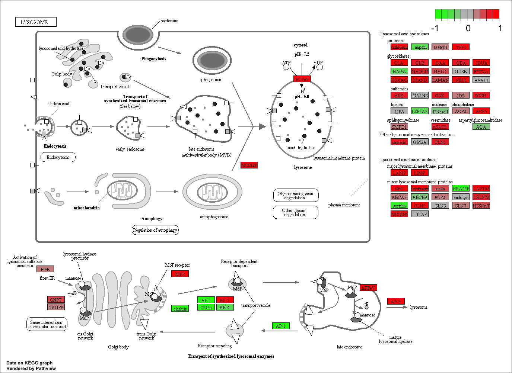

```{r setup, include=FALSE}
knitr::opts_chunk$set(echo = TRUE)
```

## RNA-Seq Results
The data for for hands-on session comes from GEO entry: GSE37704, which is associated with the following publication:

>Trapnell C, Hendrickson DG, Sauvageau M, Goff L et al. "Differential analysis of gene regulation at transcript resolution with RNA-seq". Nat Biotechnol 2013 Jan;31(1):46-53. PMID: 23222703


# Section 1. Differential Expression Analysis

```{r}
library(DESeq2)
```

```{r}
metaFile <- "data/GSE37704_metadata.csv"
countFile <- "data/GSE37704_featurecounts.csv"
```

```{r}
colData = read.csv("GSE37704_metadata.csv", row.names=1)
head(colData)
```

```{r}
countData = read.csv("GSE37704_featurecounts.csv", row.names=1)
head(countData)
```

## Remove first column from countdata
```{r}
countData <- as.matrix(countData[,-1])
head(countData)
```

>The minus sign gives us everything but the first column. But if you run it multiple times, each time, the first column will be removed.

## Remove the rows with zero counts in all experiments
```{r}
nonzero.rows<- rowSums(countData) != 0
countData<- countData[nonzero.rows,]
```

```{r}
nrow(countData)
```

## Running DESeq2

```{r}
dds = DESeqDataSetFromMatrix(countData=countData,
                             colData=colData,
                             design=~condition)
dds = DESeq(dds)
```

```{r}
dds
```

```{r}
res = results(dds, contrast=c("condition", "hoxa1_kd", "control_sirna"))
```

```{r}
summary(res)
```

## Volcano plot

```{r}
plot(res$log2FoldChange,-log(res$padj))
abline(v=c(-2,2), col="green", lty=2,lwd=2)
abline(h=-log(0.01), col="green", lty=2,lwd=2)
```

```{r}
mycols <- rep("gray", nrow(res) )
mycols[ abs(res$log2FoldChange) > 2 ] <- "red"
inds <- (res$padj<0.01) & (abs(res$log2FoldChange) > 2 )
mycols[ inds ] <- "blue"

plot( res$log2FoldChange, -log(res$padj), col=mycols, xlab="Log2(FoldChange)", ylab="-Log(P-value)" )
```

## Adding gene annotation
```{r}
library("AnnotationDbi")
library("org.Hs.eg.db")
columns(org.Hs.eg.db)

res$symbol = mapIds(org.Hs.eg.db,
                    keys=row.names(res), 
                    keytype="ENSEMBL",
                    column="SYMBOL",
                    multiVals="first")

res$entrez = mapIds(org.Hs.eg.db,
                    keys=row.names(res),
                    keytype="ENSEMBL",
                    column="ENTREZID",
                    multiVals="first")

res$name =   mapIds(org.Hs.eg.db,
                    keys=row.names(res),
                    keytype="ENSEMBL",
                    column="GENENAME",
                    multiVals="first")

head(as.data.frame(res))
```

Write out our ordered and annotated results object

```{r}
res=res[order(res$pvalue),]
write.csv(res, file="deseq_result.csv")
```

# Section 2.Pathway Analysis

```{r}
library(pathview)
library(gage)
library(gageData)
```

```{r}
data("kegg.sets.hs")
data("sigmet.idx.hs")

kegg.sets.hs=kegg.sets.hs[sigmet.idx.hs]
```

```{r}
head(kegg.sets.hs,3)
```

Create a vector of 'FoldChange' values that has ENTREZ identifers as the names of the vector. This is the format that the **gage()** function wants.
```{r}
foldchanges = res$log2FoldChange
names(foldchanges) = res$entrez
head(foldchanges)
```

Run the **gage()** function with this input

```{r}
# Get the results
keggres = gage(foldchanges, gsets=kegg.sets.hs)
```


Now let's look at the obhect returned from gage()
```{r}
attributes(keggres)
```

```{r}
# Look at the first few down (less) pathways
head(keggres$less)
```

```{r}
pathview(gene.data=foldchanges, pathway.id="hsa04110")
```

```{r}
# A different PDF based output of the same data
pathview(gene.data=foldchanges, pathway.id="hsa04110", kegg.native=FALSE)
```

## Focus on top 5 upregulated pathways here for demo purposes only
```{r}
keggrespathways <- rownames(keggres$greater)[1:5]
```


# Extract the 8 character long IDs part of each string
```{r}
keggresids = substr(keggrespathways, start=1, stop=8)
keggresids
```

```{r}
pathview(gene.data=foldchanges, pathway.id=keggresids, species="hsa")
```





#Section 3. Gene Ontology (GO)

```{r}
data(go.sets.hs)
data(go.subs.hs)

# Focus on Biological Process subset of GO
gobpsets = go.sets.hs[go.subs.hs$BP]

gobpres = gage(foldchanges, gsets=gobpsets, same.dir=TRUE)

lapply(gobpres, head)
```


#Section 4. Reactome Analysis

```{r}
sig_genes <- res[res$padj <= 0.05 & !is.na(res$padj), "symbol"]
print(paste("Total number of significant genes:", length(sig_genes)))
```

```{r}
write.table(sig_genes, file="significant_genes.txt", row.names=FALSE, col.names=FALSE, quote=FALSE)
```


